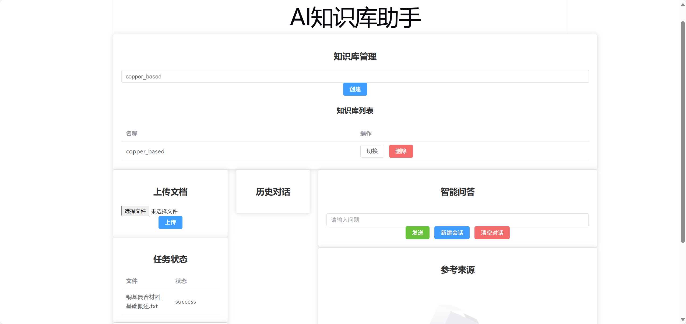
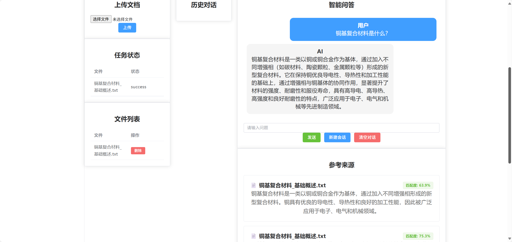
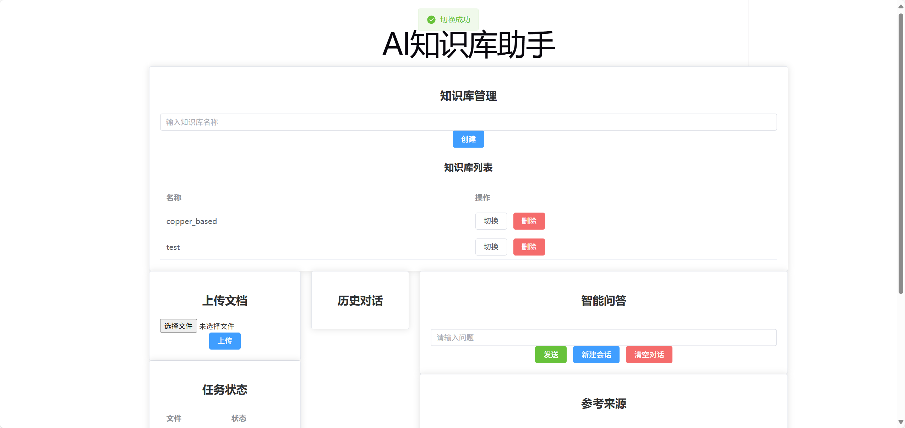
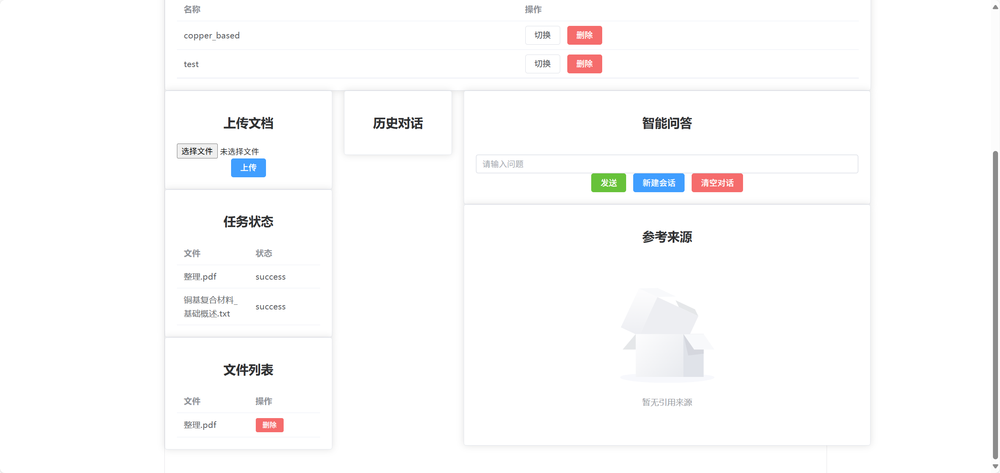
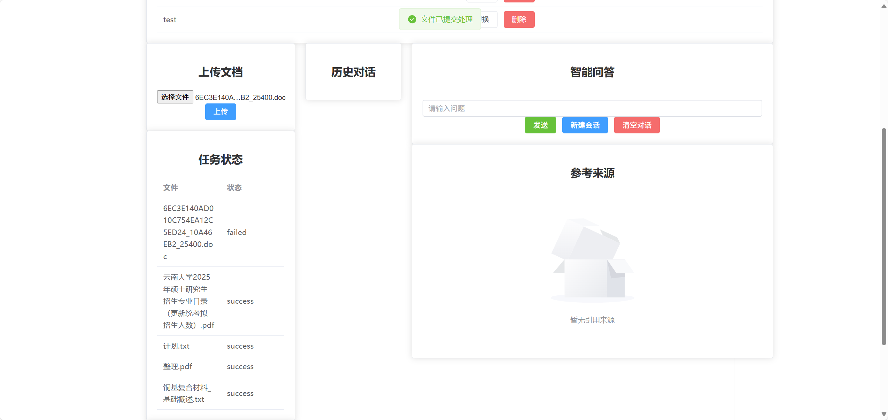

# AI知识库助手（Multi-Knowledge Base RAG System）

基于FastAPI + Vue3实现的企业级知识库问答系统。

系统支持文档上传、智能解析、向量化索引构建以及基于大语言模型的检索增强生成（RAG），
通过Hybrid Retrieval（FAISS + BM25）、CrossEncoder Rerank和Query Rewrite提升知识检索准确性。

同时支持多用户知识库隔离、Conversation Memory、异步文档处理以及任务状态管理，
实现从文档处理、检索增强到智能问答的完整工程化流程。

系统实现完整RAG Pipeline：

Document Processing:

Upload
→ Parsing
→ Chunking
→ Embedding
→ Index Building

Retrieval Augmented Generation:

Query
→ Query Rewrite
→ Hybrid Retrieval
→ Rerank
→ LLM Generation
→ Source Tracking

支持：
- 多知识库管理
- Hybrid Retrieval
- CrossEncoder Rerank
- Query Rewrite
- Conversation Memory
- JWT Authentication
- Async Document Processing
- Retriever Evaluation

项目截图

1. 系统主页

2. RAG问答与来源追踪
用户输入问题后，系统经过：
Query
→ Query Rewrite
→ Embedding
→ Hybrid Retrieval
→ Rerank
→ LLM Generation
→ Answer + Source Tracking
最终返回回答，同时展示原始文件来源

3. 多知识库管理
输入不同的kb_name，
可展示出不同的文件列表
同时在问答阶段只从该kb里检索

4. 文档上传
用户上传文档后，系统生成Task任务，
通过Celery + Redis异步执行：
Upload
→ Create Task
→ Celery Worker
→ Document Pipeline
→ Update Index
→ Update Task Status

前端实时展示任务状态：
- pending
- processing
- success
- failed

任务完成后更新：
- FAISS Index
- BM25 Index





## 项目亮点

### Document Pipeline

- PDF/TXT Parsing
- Chunk Split
- Embedding
- Index Building

### Retrieval Pipeline

- FAISS Retrieval
- BM25 Retrieval
- RRF Fusion
- CrossEncoder Rerank

### Knowledge Management

- Multi Knowledge Base
- User Permission Isolation
- Document Management

### Engineering

- MySQL Persistence
- Redis Cache
- Celery Async Pipeline
- Task Status Tracking
- Docker Support

### Conversation

- Persistent Conversation Memory
- Query Rewrite
- SSE Streaming Response


## 实验效果

### Retriever Evaluation

| Retriever | Recall@1 | Recall@3 | Recall@5 | MRR    |
|-----------|----------|----------|----------|--------|
| FAISS     | 25.86%   | 43.10%   | 50.00%   | 35.26% |
| BM25      | 48.28%   | 74.14%   | 82.76%   | 60.92% |
| Hybrid    | 63.79%   | 86.21%   | 87.93%   | 74.28% |

详细实验：
`docs/retrieval_evaluation.md`

### Query Rewrite Evaluation

| Method        | Recall@1 | Recall@3 | Recall@5 | MRR    |
|---------------|----------|----------|----------|--------|
| Base Query    | 43.10%   | 58.62%   | 65.51%   | 52.21% |
| Query Rewrite | 58.62%   | 84.48%   | 86.20%   | 70.54% |

详细实验：
`docs/retrieval_evaluation.md`


## 系统架构
系统采用模块化 RAG 架构，
整体由 Web Interface、API Layer、
Document Processing Pipeline、
Retrieval System 和 LLM Service组成。

```text
                         User
                          |
                    Vue3 Interface
                          |
                   FastAPI Backend
                          |
              +-----------+-----------+
              |                       |
         Upload API                Chat API
              |                       |
           Celery                 Retriever
              |                       |
       Document Pipeline          FAISS/BM25
              |                       |
            MySQL                    LLM
          
```

详细：`docs/overall_architecture.md`


## 技术栈

Backend：

- FastAPI
- SQLAlchemy
- Python
- JWT Authentication

RAG：

- SentenceTransformers
- FAISS
- BM25
- CrossEncoder
- jieba
- Qwen API

Storage：
- MySQL
- Redis

Engineering：
- Docker
- Celery


## 项目结构

```text
app/
├── api/                 # API接口层
├── auth/                # 鉴权系统
├── bm25/                # BM25Store关键词检索
├── cache/               # Redis缓存
├── core/                # 检索服务依赖容器
├── crud/                # 数据访问层
├── data/                # evaluate测试集
├── database/            # 数据库连接
├── document/            # 文档解析与Pipeline
├── embedding/           # Embedding模块
├── evaluation/          # 检索评估
├── exceptions/          # 全局异常处理
├── knowledge_base/      # 知识库管理
├── llm/                 # Qwen调用
├── memory/              # 多轮会话记忆
├── models/              # 数据模型层
├── prompts/             # Prompt构建
├── query/               # query rewrite
├── retriever/           # FAISS、BM25、Rerank、Retriever
├── schemas/             # Pydantic模型
├── services/            # 业务逻辑
├── tasks/               # 异步任务
├── vector_store/        # 向量存储与管理
└── config.py            # 项目配置
```

## 具体文档

详细设计文档：

- System Architecture  
  `docs/architecture/overall_architecture.md`

- Document Pipeline  
  `docs/data_management/document_pipeline.md`

- Retriever Pipeline  
  `docs/rag/retriever_pipeline.md`

- FAISS Design  
  `docs/rag/faiss.md`

- BM25 Design  
  `docs/rag/bm25.md`

- Rerank Design  
  `docs/rag/rerank.md`

- Cache Architecture  
  `docs/data_management/cache_design.md`

- Conversation Memory  
  `docs/user_system/conversation_memory.md`

- Authentication  
  `docs/user_system/user_authentication.md`

- Evaluation  
  `docs/evaluation/retrieval_evaluation.md`

## 启动方式

### 后端

```bash
pip install -r requirements.txt

uvicorn main:app --reload
```

### 前端

```bash
npm install

npm run dev
```

### Docker
```bash

docker-compose up

```

### Redis
```bash
docker start redis
```

### Celery Worker
```bash
celery -A app.tasks.celery_app.celery_app worker -l info
```

## 后续计划

- [x] Retriever Recall Evaluation
- [x] 多知识库管理
- [x] 用户级Conversation Memory隔离
- [x] Docker 部署
- [x] MySQL数据持久化
- [x] 前端页面
- [x] JWT Authentication
- [x] Knowledge Base Permission Control
- [x] Query Rewrite
- [x] Hybrid Score Fusion
- [x] Redis缓存与任务队列
- [ ] Elasticsearch 检索
- [ ] 工业场景数据处理
- [ ] Linux部署


## API Examples

### Upload Document
```http
POST /files/
```

Content-Type: multipart/form-data

Parameters:
file: 研究背景.txt
kb_name: copper

### Chat

```http
POST /chat/chat/stream
```
Request:

{
 "query":"铜基复合材料的特点?",
 "kb_name":"copper_based"
}

Response:

Server-Sent Events
