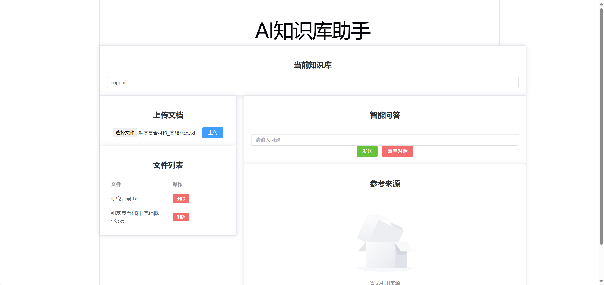
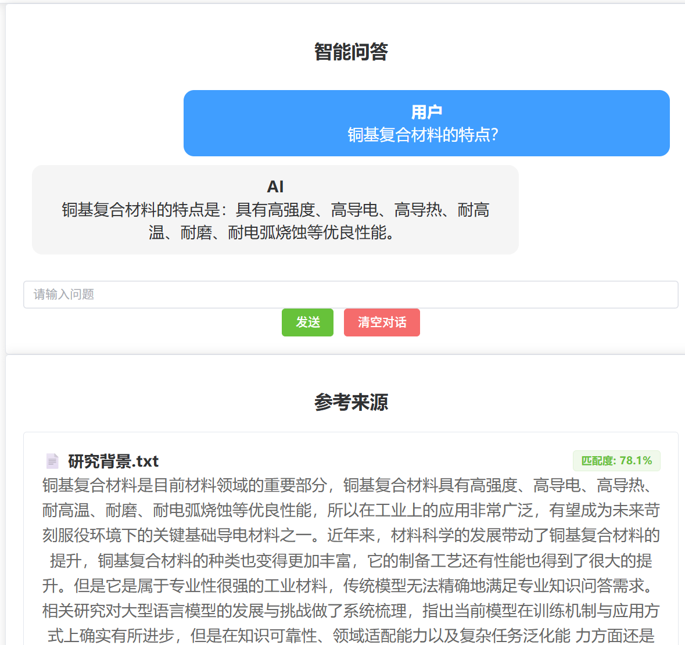
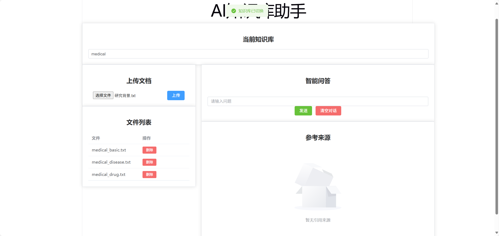
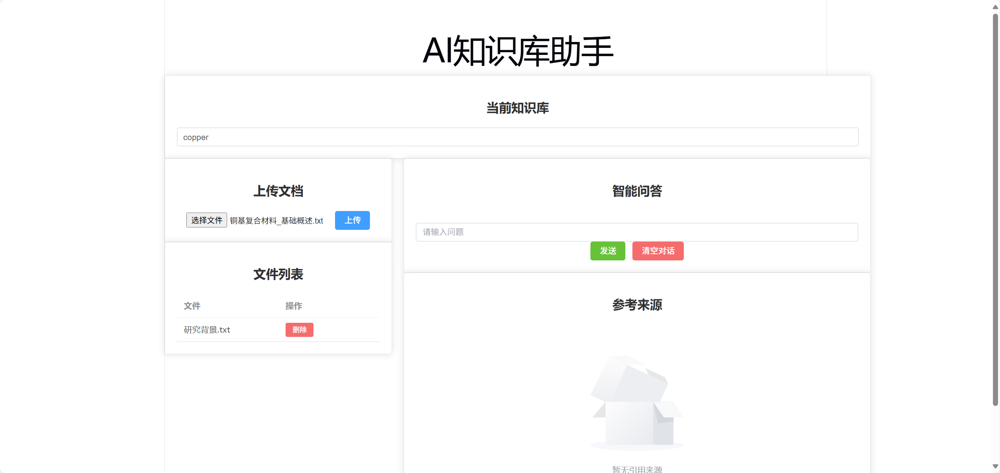

# AI知识库助手（Multi-Knowledge Base RAG System）

项目截图

1. 系统主页

2. RAG问答与来源追踪
用户输入问题后，系统经过：
Query
→ Embedding
→ Hybrid Retrieval
→ Rerank
→ LLM Generation
最终返回回答，同时展示原始文件来源

3. 多知识库管理
输入不同的kb_name，
可展示出不同的文件列表
同时在问答阶段只从该kb里检索

4. 文档上传
用户上传文件后，文件被传入指定知识库，
将文档doc以及切分出的chunks存入MySQL，
根据数据库为chunks自动生成的Chunk_id，
将chunk_ids和texts传入faiss，
进行faiss、bm25存储



## 项目亮点

- 完整RAG Pipeline
- Hybrid Retrieval(FAISS + BM25)
- CrossEncoder Rerank 提升检索准确率
- 多知识库隔离架构
- MySQL + Vector Index混合存储
- Retriever Evaluation体系
- SSE流式生成
- Vue3 Web Interface
- Multi-layer Resource Lifecycle Management
- Model Lifecycle Management for Embedding and Reranker
- Batch Inference Optimization for CrossEncoder


## 1. 项目简介
基于 FastAPI 的多知识库系统RAG（Retrieval Augmented Generation）问答系统，
实现文档上传、PDF/TXT解析、chunk切分、向量化、检索增强生成的完整流程。
系统通过 SentenceTransformer 生成向量表示，
使用 FAISS 构建向量索引，同时结合 BM25 关键词检索进行 Hybrid Retrieval，
并使用 CrossEncoder 对候选结果进行重排序，提高检索准确性。

系统支持多个独立知识库管理，每个知识库拥有独立的数据目录和检索索引，
同时使用 MySQL管理 知识库、文档、chunk等数据，
实现知识库之间的数据隔离以及检索索引与业务数据的分离。

在生成阶段，系统结合大语言模型（Qwen），
根据检索结果构建上下文并生成最终回答，实现“检索增强生成”的完整闭环。


## 2. 系统架构
系统采用模块化 RAG（Retrieval Augmented Generation）架构，
整体由文档处理层、数据存储层、检索层和生成层组成。

```text
                         User
                          |
              +-----------+-----------+
              |                       |
            Upload                 Query
              |                       |
      Document Pipeline          Chat Pipeline
              |                       |
      PDF/TXT Parsing                |
              |
      Chunk Split
              |
      Embedding Generation
              |
              |
       Database Layer
              |
     +--------+--------+
     |                 |
Knowledge Base A   Knowledge Base B
     |                 |
 MySQL Metadata   MySQL Metadata
     |
 VectorStoreManager
     |
 +---+----------------+
 |                    |
FAISS Index        BM25 Index
 |
 |
Hybrid Retrieval
 |
Metadata Filter
 |
Deduplication
 |
CrossEncoder Rerank
 |
Context Construction
 |
Qwen LLM
 |
Answer + Source Tracking
```
## 3. 核心功能

### 文档处理
- 文件上传（PDF / TXT）
- 文档解析
- 文本chunk切分（基于句子切分与 overlap 的 chunk 分割）
- 数据流处理pipeline

### 检索系统
- 向量检索（FAISS）
- BM25 关键词检索
- Hybrid Retrieval（FAISS + BM25）
- CrossEncoder Rerank 重排序
- Metadata Filter（元数据过滤）
- Source Tracking（答案来源追踪）

### 多知识库管理
- 支持创建多个独立知识库
- 每个知识库独立维护 FAISS Index
- 每个知识库独立维护 BM25 Index
- VectorStoreManager 管理不同知识库实例
- 知识库数据持久化加载
- 数据库之间数据隔离

### 数据管理
- MySQL存储知识库信息
- MySQL存储文档信息
- MySQL存储chunk文本和metadata
- FAISS/BM25作为检索索引

### LLM问答
- 基于检索内容的 LLM 问答（Qwen）
- Qwen API 调用
- Context 构建
- 检索结果与原文映射（source tracking）
- 基于内存的多轮对话上下文管理

### 工程能力
- 删除文档
- 全局异常处理
- Recall@K 检索评估
- MRR (Mean Reciprocal Rank)
- pytest 测试
- 数据持久化
- 模块化FastAPI项目结构
- Docker容器化运行支持
- 环境变量管理

## 4. 技术栈
- FastAPI
- PyPDF2
- Python
- SentenceTransformers（文本向量化）
- FAISS（向量检索） 
- OpenAI Compatible API（Qwen）
- Pickle（BM25持久化）
- rank-bm25
- Retriever Evaluation 测试体系
- Pydantic
- BGE CrossEncoder Reranker
- Recall@K
- SQLAlchemy
- MySQL


## 5. 项目结构

```text

app/
├── api/                 # API接口层
├── bm25/                # BM25Store关键词检索
├── core/                # 检索服务依赖容器
├── crud/                # 数据访问层
├── database/            # 数据库连接
├── document/            # 文档解析与Pipeline
├── embedding/           # Embedding模块
├── evaluation/          # 检索评估
├── exceptions/          # 全局异常处理
├── knowledge_base/      # 知识库管理
├── llm/                 # Qwen调用
├── memory/              # 多轮会话记忆
├── models/              # 数据模型层
├── prompts/             # Prompt构建
├── retriever/           # FAISS、BM25、Rerank、Retriever
├── schemas/             # Pydantic模型
├── services/            # 业务逻辑
├── vector_store/        # 向量存储与管理
│   ├── faiss_store.py
│   └── store_manager.py
└── config.py            # 项目配置
```


## 6. 核心设计

### 6.1 多知识库隔离设计

系统通过 VectorStoreManager 管理不同知识库对应的 VectorStore 实例。

每个知识库拥有独立：

- FAISS索引
- BM25索引
- MySQL中的业务数据隔离

避免不同知识库之间的数据污染。

VectorStoreManager 通过 kb_name 管理不同 VectorStore 实例，
每个实例内部维护对应知识库自己的 FAISS Index 和 BM25 Index。
FAISS 使用 IndexIDMap 显式绑定数据库 chunk_id，
避免向量索引编号与业务数据编号不一致。

### 6.2 Hybrid Retrieval

查询过程：

用户问题

↓

Embedding生成

+

关键词分词

↓

FAISS语义检索

+

BM25关键词检索

↓

返回chunk_id

↓

MySQL查询Chunk文本和Metadata

↓

结果合并去重

↓

CrossEncoder重排序

↓

LLM生成回答


### 6.3 Retriever Evaluation

系统提供检索效果评估：

- Recall@1
- Recall@3
- Recall@5
- MRR

通过测试集验证 Retriever 的召回能力。

实验结果：

| Retriever | Recall@1 | Recall@3 | Recall@5 | MRR  |
|-----------|----------|----------|----------|------|
| FAISS     | 0.61     | 0.92     | 1.0      | 0.77 |
| BM25      | 0.61     | 1.0      | 1.0      | 0.80 |
| Hybrid    | 0.76     | 1.0      | 1.0      | 0.88 |


### 6.4 数据存储设计
系统采用：MySQL + FAISS + BM25

混合存储架构。

MySQL负责：
- Knowledge Base信息
- Document信息
- Chunk文本
- Metadata

FAISS负责：
- Embedding向量索引

BM25负责：
- 关键词检索索引

#### 数据流：
Document

↓

Chunk

↓

MySQL保存文本和Metadata以及chunk_id

↓

生成embedding

↓

FAISS保存(vector, chunk_id)

↓

BM25保存(keyword index, chunk_id)


### 6.5 Resource Lifecycle Management
由于RAG系统同时包含数据库、文件系统以及内存缓存，
因此系统需要保证不同存储层之间的数据一致性。
本系统包含了三类存储：

               RAG Resource

      +-------------+-------------+
      |             |             |

    MySQL       File System    Memory Cache

MySQL负责业务数据：
- KnowledgeBase
- Document
- Chunk

File System负责；
- 上传文件
- FAISS Index
- BM25 Index

Memory Cache负责：
- VectorStore实例缓存

#### 缓存失效机制
为了避免每次查询重新加载索引，
系统通过 VectorStoreManager 缓存不同知识库对应的 VectorStore。

当知识库数据发生变化：
- 上传文件
- 删除文档
- 删除知识库

系统会主动清理对应的缓存。


通过资源生命周期管理，避免出现：

- 数据库已删除但文件残留
- 索引已更新但缓存仍保存旧状态
- 不同知识库之间资源污染

提高系统稳定性和可维护性。


## 7. Architecture Evolution
### V1 Basic RAG

实现基础:
- 文档解析
- Chunk 切分
- Embedding
- FAISS检索
- LLM生成


### V2 Multi Knowledge Base RAG

升级:
- 多知识库隔离
- MySQL数据持久化
- FAISS + BM25 Hybrid Retrieval
- CrossEncoder Rerank
- Retriever Evaluation
- Docker部署
- pytest测试
- 数据库chunk_id作为索引唯一标识
- Retriever抽象接口设计
- FAISS/BM25统一结果结构


### V3 Engineering Interface

新增:
- Vue3 前端交互界面
- 文件管理
- SSE流式回答
- Source Tracking 可视化
- 用户交互反馈


## 8. 数据存储结构
```text
data/
└── knowledge_bases/
    ├── copper_based/
    │   ├── files/
    │   ├── faiss.index
    │   └── bm25.pkl
    │   
    │
    └── medical/
        ├── files/
        ├── faiss.index
        └── bm25.pkl

MySQL：
    Knowledge_base
      |
      |
   Document
      |
      |
    Chunk
        
        
Vector Storage:

FAISS
(chunk_id -> embedding)


BM25
(chunk_id -> text)

```

## 9. 启动方式

### 后端

```bash
pip install -r requirements.txt

uvicorn main:app --reload
```

### 前端

```bash
npm install

npm run dev
```

### Docker
```bash

docker-compose up

```

## 10. 后续计划

- [x] Retriever Recall Evaluation
- [x] 多知识库管理
- [x] 对话历史（Conversation Memory）
- [x] Docker 部署
- [ ] Redis缓存与任务队列
- [x] MySQL数据持久化
- [ ] Hybrid Score Fusion
- [ ] Elasticsearch 检索
- [ ] Milvus / Chroma 向量数据库
- [x] 前端页面


## API Examples

### Upload Document
```http
POST /files/
```

Content-Type: multipart/form-data

Parameters:
file: 研究背景.txt
kb_name: copper

### Chat

```http
POST /chat/chat/stream
```
Request:

{
 "query":"铜基复合材料的特点?",
 "kb_name":"copper_based"
}

Response:

Server-Sent Events
