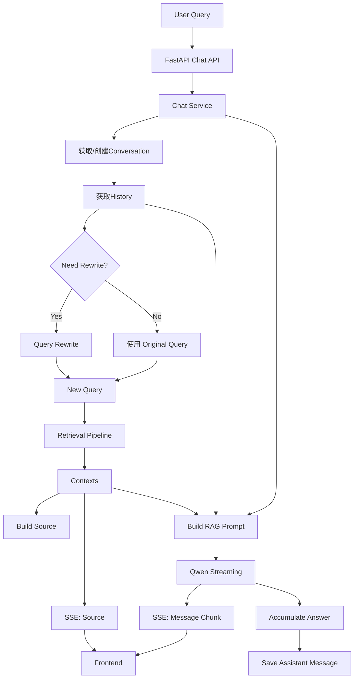

# Chat Pipeline

## 1. 模块概述

### 1.1 模块职责

- 接受用户问题
- 管理Conversation/History
- Query Rewrite
- 调用Retrieval Pipeline
- 返回参考信息
- 构建RAG Prompt
- 调用LLM
- SSE流式对话
- 保存对话消息

### 1.2 整体流程



## 2. Chat请求入口

### 2.1 请求参数
- query
- kb_name
- conversation_id
- owner_id
- filters

### 2.2 Chat Service
- Chat Service作为整个问答流程的编排层
- 不直接负责底层Retrieval/LLM实现
- 负责按照顺序调用模块

## 3. Conversation与History

### 3.1 已有Conversation
```text
conversation_id
     ↓
conversation校验
     ↓
 Message查询
     ↓
build_history()
     ↓
  history
```

### 3.2 新建Conversation
```text
conversation_id = None
        ↓
  查询Knowledge Base
        ↓
     获取kb_id
        ↓
  创建Conversation
        ↓
    messages = []
        ↓
   build_history()
```

### 3.3 Conversation ID返回
新建会话后生成conversation_id，通过SSE返回前端，
后端请求携带conversation_id。

## 4. Query Rewrite

### 4.1 为什么需要Rewrite
- 补充用户省略信息
- 解决指代问题
- 提高Retrieval准确率

### 4.2 Rewrite判断
```text
Original Query
      ↓
need_rewrite()
      ↓
 ┌────┴────┐
Yes        No
 ↓          ↓
Rewrite  Original Query
 ↓          ↓
 └────┬─────┘
      ↓
  New Query
```

### 4.3 Original Query 与 New Query

| Query          | 用途                    |
|----------------|-----------------------|
| original_query | 用于保存用户原始问题，构建最终Prompt |
| new_query      | 用于Retrieval           |

## 5. User Message持久化

### 5.1 保存用户原始问题
```text
Original Query
      ↓
create_message()
      ↓
  MySQL Message
  role = user
```

### 5.2 为什么保存Original Query

- 保留用户真实输入
- Rewrite属于内部检索优化过程
- 不应该修改原始聊天记录

## 6. Retrieval

### 6.1 Retrieval Cache
New Query进入retrieval模块后，首先查询Cache
```text
New Query
    ↓
Retrieval Cache
   ├── Hit → 直接返回 Contexts
   └── Miss
          ↓
   Hybrid Retrieval
```

### 6.2 Hybrid Retrieval
当 Redis Cache Miss以后，进入Hybrid Retrieval处理：
```text
FAISS + BM25
      ↓
     RRF
      ↓
CrossEncoder Rerank
      ↓
   Contexts
```
后续操作：`retriever_pipeline.md`

## 7. Contexts 与 Sources

### 7.1 Contexts
- Retrieval Pipeline返回的内部结果
- 提供给RAG Prompt使用

### 7.2 Sources
```text
Contexts
   ↓
build_sources()
   ↓
 Sources
```
用于：
- 前端展示参考资料
- 展示Chunk来源
- 展示Chunk
- 展示Score

### 7.3 Contexts与Source的区别
| 数据       | 作用          |
|----------|-------------|
| contexts | 后端RAG/LLM使用 |
| sources  | 前端参考资料展示    |

## 8. SSE流式响应

### 8.1 Source Event

```text
Retrieval 结束
    ↓
 Sources
    ↓
   SSE
    ↓
 Frontend
```
将参考资料一次性发送。

### 8.2 Message Event

```text
 Qwen
  ↓
Chunk 1
  ↓
Chunk 2
  ↓
Chunk 3
  ↓
 ...
  ↓
 SSE
  ↓
Frontend
```
LLM回答按照Chunk持续发送。

### 8.3 为什么使用SSE
- 实现LLM流式输出
- 允许先返回参考资料，再持续返回回答

## 9. RAG Prompt构建

### 9.1 Prompt输入
```text
History
   +
Contexts
   +
Original Query
   ↓
Prompt Builder
   ↓
RAG Prompt
```

### 9.2 三者作用
- history：提供历史对话上下文
- contexts：提供知识库检索结果
- original_query：提供当前用户问题

## 10. LLM Streaming

### 10.1 Qwen调用
```text
RAG Prompt
    ↓
  Qwen
    ↓
stream=True
```

### 10.2 Chunk处理
```text
answer = ""

for chunk in chat_with_qwen_stream(prompt):
    answer += chunk
    yield chunk 
```
chunk SSE 负责前端实时展示
chunk answer 负责累计完整答案

## 11. Assistant Message 持久化
```text
LLM Chunk
    ↓
answer += chunk
    ↓
完整Answer
    ↓
create_message()
    ↓
 MySQL Message
role = assistant
```

## 12. 关键设计总结

### 13.1 Original/New Query 分离
```text
Original Query → Message / Prompt
New Query → Retrieval
```

### 13.2 Context/Source 分离
```text
Contexts → 后端 RAG
Sources → 前端展示
```

### 13.3 Source/Message 两阶段SSE
```text
Source → 一次性返回参考资料
Message → Chunk 流式返回LLM答案 
```

### 13.4 Chunk同时承担两个任务
```text
Chunk
 ├──→ SSE → 前端
 └──→ answer → 数据库存储
```

### 13.5 Chat Service的核心职责
```text
Chat Service本身不是 Retrieval、Rewrite或LLM，
而是负责将 Conversation、Rewrite、Retrieval、Prompt、LLM、SSE和Message Persistence 
按照正确的数据流进行编排。
```
