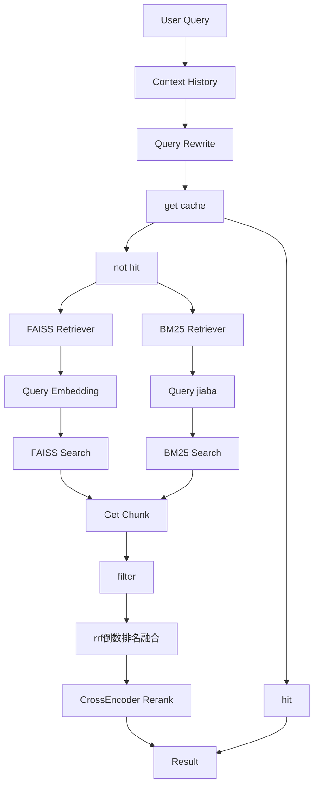
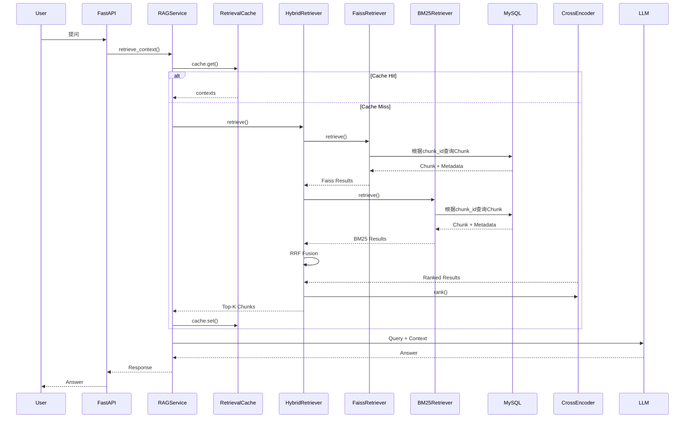

# Retriever Pipeline

## 1. 模块概述

Retriever Pipeline 主要负责根据用户上传的问题来匹配并召回最相近的Chunk，以作为后续问答的参考资料。

主要职责：
- 接受用户上传的问题
- Query Embedding生成
- FAISS语义检索
- BM25关键词检索
- Hybrid Retrieval结果合并
- RRF倒数排名融合
- CrossEncoder重排序
- 返回Top-K相关Chunk

核心目标：
- 获取与用户问题最相关的资料Chunk
- 为后续Qwen问答提供足够相关的资料


## 2. 业务目标

由于企业的知识库常常过于庞大，大量的PDF等文档无法高效的进行阅读，即便使用AI辅助也会受到篇幅长度的限制，
因此设计Hybrid Retriever进行召回，对大量文档进行splitter，最终实现只返回少量的Chunk信息，
通过语义大模型进行分析处理，最终实现有效的内部知识库问答。
为了提高Retriever的检索效果，系统结合FAISS语义检索和BM25关键词检索的优点，
同时召回语义和关键词最为匹配的Chunk，并进行RRF倒数排名融合，最后通过CrossEncoder筛选出最合适的Chunk。

Chunk召回：
```text
            用户上传问题
                |
            获取上下文
                |
           Query Rewrite
                |
            get cache
                |
      ----------+---------+
      |                   |
FAISS Retriever    BM25 Retrieval
      |                   |
 Query Embedding     Query jieba
      |                   |
 faiss search         bm25 search
      |                   |
      +----------+--------+
                 |
            得到chunk_id     
                 |                  
              get Chunk      
                 |                  
              filters
                 |
              Results
                 |             
            RRF倒数排名融合
                 |
         CrossEncoder Rerank
 
```

## 3. 整体架构




## 完整执行流程



用户提出问题后，经过Chat模块的Rewrite后，进入Retriever模块，
首先进行FAISS向量匹配，根据语义相似度选择出最相近的Chunk_ids，
然后进行BM25关键词匹配，根据关键词选择出最相近的Chunk_ids，
根据chunk_ids从MySQL中找出对应的Chunks，根据Chunk信息以及Metadata进行RRF Fusion倒数排名融合，
将倒数排名融合的结果选取出候选集送入CrossEncoder进行Rerank，重新排序得到合适的Context，
最终将保存到Redis缓存并其送入LLM进行回答。

## 5.核心流程详解

### 5.1 Query Processing
用户提出问题，首先在Chat阶段进行Rewrite，
将新问题送入Retrieval模块进行Context召回。

```text
 用户问题
    ↓
  Rewrite
    ↓
 Retrieval
```

### 5.2 Query Embedding
在FAISS Retriever阶段，为了计算语义相似度，
需要对问题进行向量化Embedding。
在此期间为了减少重复计算 Query Embedding 的开销，系统对 Embedding 结果进行 Redis 缓存。
否则则需要进行get_embedding，生成768维向量

### 5.3 FAISS语义检索

系统通过FAISS进行语义相似度计算，并进行排序处理，返回最相似的top_k。
self.index.search，返回distances和indices，
由于IndexIDMap使用显式ID，将chunk_id传入了self.index，
因此indices即chunk_Ids，根据chunk_ids取得MySQL中存储的Chunk。
IndexFlatIP是精准暴力搜索，通过将query_embedding对Context_embedding逐个计算内积，
利用归一化使得内积等价于余弦相似度，得到语义最相近的Chunk。

```text
    Query
      ↓
 Query Embedding
      ↓
  FAISS Search
      ↓
  distances+indices     
```

### 5.4 BM25关键词检索

通过BM25进行关键词匹配。首先将用户问题进行jieba分词处理，
根据jieba分词的内容与bm25内部的关键词进行匹配，找到关键词层面最相近的索引。
关键词匹配主要根据TF、IDF、Length Normalization等指标进行计算score，
用以弥补FAISS语义相似度检测无法命中关键词的短板，提高Retrieval效果。

```text
    Query
      ↓
   jieba Query
      ↓
   BM25 Search
      ↓
 bm25 get_scores
```

### 5.5 Hybrid Retrieval

系统在FAISS和BM25 Search之后，需要进行进一步合并处理，
通过RRF对 FAISS TopK + BM25 Top 合并。
```text
    FAISS Result + BM25 Result
                 ↓
            RRF 倒数排名融合
                 ↓
           返回重排后Context
```
Hybrid Retrieval并非简单拼接FAISS和BM25结果，
而是先利用RRF融合不同检索器的排名，
再通过CrossEncoder进行精排，
从而兼顾召回率与准确率。

### 5.6 CrossEncoder排序
CrossEncoder同时接收：
Query
+
Candidate Chunks

CrossEncoder同时接收Query和Candidate Chunks，
通过交叉编码计算两者相关性分数，
并根据分数重新排序候选Chunk。

### 5.7 Retrieval Cache

根据用户输入的问题，可将Retrieval内容存入Redis，设置过期时间，
每次进行Retrieval之前，查询Redis是否存在对应key，存在则直接返回，
否则继续执行Hybrid Retrieval流程。


## 6. 数据流与数据关系

### 6.1 整体数据流
```text
User Query
    │
    ▼
Query Rewrite
    │
    ▼
Rewritten Query
    │
    ├──────────────────────┐
    │                      │
    ▼                      ▼
FAISS                  BM25
    │                      │
    ▼                      ▼
chunk_id + score      chunk_id + score
    │                      │
    └──────────┬───────────┘
               ▼
          RRF Fusion
               │
               ▼
          Candidate Chunks
               │
               ▼
          CrossEncoder
               │
               ▼
           Top-K Chunks
               │
               ▼
         Retrieval Context
               │
               ▼
              LLM
```


### 6.2 Query 数据

用户输入的问题首先进入 Retrieval Pipeline。
```text
User Query
    │
    ▼
Query Rewrite
    │
    ▼
Rewritten Query
```

### 6.3 FAISS 数据

FAISS主要保存文档Chunk对应的向量以及chunk_id

```text
Query
  │
  ▼
Embedding
  │
  ▼
FAISS Search
  │
  ▼
[
    {
        chunk_id,
        score
    }
]
```

### 6.4 BM25 数据

BM25根据Query中的关键词进行检索
```text
Query
  │
  ▼
BM25 Search
  │
  ▼
[
    {
        chunk_id,
        score
    }
]
```

### 6.5 chunk_id数据关联

FAISS 和 BM25 检索完成后，都会返回 chunk_id。
系统通过：
```text
chunk_crud.get_chunks_by_ids(
    db,
    chunk_ids
)
```
批量查询 MySQL 中对应的 Chunk。

### Retrieval统一数据格式
FaissRetriever 和 BM25Retriever 最终都会通过
build_retriever_results() 将检索结果转换为统一的数据结构。
```text
{
    "text": chunk.content,
    "chunk_id": chunk.id,
    "score": hit["score"],
    "source": source,
    "metadata": chunk.metadata_info
}
```

## 7. 核心设计

### 7.1 为什么使用Hybrid Retrieval
为了提高Retrieval召回准确性，系统结合FAISS和BM25两种检索方式，
兼顾语义和关键词两个维度进行召回，使用FAISS进行语义相似度检索，
使用BM25进行关键词检索，提高检索效果。

### 7.2 为什么使用CrossEncoder
由于通过FAISS和BM25检索召回的Chunk数量过多，直接提供给大模型会造成语义稀释，
因此通过CrossEncoder对待筛选的Chunk进行Rerank，进一步缩小检索范围，提高Chunk质量。

### 7.3 为什么使用Chunk ID映射
Chunk ID可以将MySQL、FAISS与BM25之间建立联系，使用同一个索引，
每次从FAISS中查询出chunk_id，都可以利用chunk_id将MySQL中的Chunk取出

### 7.4 多知识库隔离
系统通过使用owner_id和kb_name进行知识库选择，
在用户鉴权的时候取得owner_id，利用owner_id+kb_name锁定目标知识库，
最终从目标知识库中进行Chunk筛选召回，减少搜索范围

### 7.5 Cache设计
在Retrieval中，主要将Query Embedding和Retriever Context存入Redis，
此后每次对Query进行get_embedding时或者进行Retrieval时，
都会首先查询Redis，如果命中则直接返回，否则按照完整流程执行，并在完成之后将结果存入Redis。
若有文档上传或删除等修改操作时，将Redis中对应内容删除，保持数据一致性。

### 7.6 为什么使用RRF
FAISS和BM25的评分体系不同：
FAISS使用cosine similarity进行评分，BM25使用keyword score进行评分，两者分数无法直接相加。

因此系统采用RRF（Reciprocal Rank Fusion），根据排名而非原始分数进行融合。
RRF Score：
1/(k+rank1)
+
1/(k+rank2)

这样可以有效融合不同检索器的结果，提高召回稳定性。

## 8. 性能评估

| Retriever | Recall@1 | Recall@3 | Recall@5 | MRR    |
|-----------|----------|----------|----------|--------|
| FAISS     | 25.86%   | 43.10%   | 50.00%   | 35.26% |
| BM25      | 50.00%   | 77.59%   | 87.93%   | 64.22% |
| Hybrid    | 62.07%   | 89.66%   | 98.28%   | 75.46% |

经过evaluate后，可见FAISS+BM25效果要强于FAISS和BM25中任何一个。
同时BM25的效果要强于FAISS，印证了文档中主要为专业知识、大量存在专业术语的特征。

## 9. 异常与失败场景

### 9.1 FAISS索引不存在
```text
    用户提问
       ↓
    加载知识库
       ↓
  FAISS索引不存在
       ↓
    检索失败
```

可能原因：
- 新建知识库但未上传文档
- FAISS文件被误删
- 索引构建失败

### 9.2 BM25索引不存在
```text
用户提问
   ↓
加载BM25
   ↓
bm25.pkl不存在
   ↓
BM25检索失败
```

可能原因：
- 文档未完成构建
- bm25.pkl被误删
- 上传任务异常终止

### 9.3 Embedding失败
```text
用户提问
   ↓
Query Embedding
   ↓
Embedding失败
```

可能原因：
- Embedding模型未加载
- 模型文件损坏
- 显存/内存不足


### 9.4 CrossEncoder失败
```text
FAISS召回+BM25召回
   ↓
RRF融合
   ↓
CrossEncoder
   ↓
失败
```

可能原因：
- 模型未加载
- GPU显存不足
- 推理异常
- 模型文件损坏

### 9.5 KnowledgeBase不存在
```text
用户提问
   ↓
查询知识库
   ↓
KnowledgeBase不存在
```
可能原因：
- 知识库已删除
- 用户无权访问

## 10. 后续优化方向

### 10.1 Agent Retrieval
当前系统采用固定流程：
```text
Query
  ↓
FAISS
+
BM25
  ↓
Rerank
  ↓
 LLM
```

所有问题均使用相同的检索策略，后续计划引入 Agent 机制，根据问题类型动态选择检索方式。
例如：
```text
     用户问题
       ↓
  Agent Router
       ↓
 ┌─────┼─────┐
 │     │     │
FAQ  BM25  FAISS
 │     │     │
 └─────┼─────┘
       ↓
    Retrieval
```

预期收益：

- 根据问题类型选择最优检索器
- 减少无效召回
- 提高复杂场景问答能力

### 10.2 Elasticsearch 检索

当前系统关键词检索使用BM25，但是随着知识库规模增大，单机 BM25 检索效率会逐渐下降。
后续计划引入Elasticsearch：
```text
Chunk
   ↓
Elasticsearch
   ↓
Inverted Index
   ↓
Distributed Search
```
最终形成：
```text
FAISS
+
Elasticsearch
+
Reranker
```

预期收益：

- 支持百万级文档检索
- 分布式扩展能力
- 更强的关键词搜索能力
- 支持复杂过滤条件
- 支持高并发查询

## 11. 模块总结

Retrieval Pipeline是RAG系统的核心模块，主要使用了FAISS、BM25、CrossEncoder、RRF等技术，

通过：

FAISS
+
BM25
+
CrossEncoder

实现高召回率和高准确率的知识检索。

实验结果表明，Hybrid Retrieval的Recall@K和MRR均优于单独使用FAISS和BM25，
因此系统采用Hybrid Retrieval作为最终检索方案。
