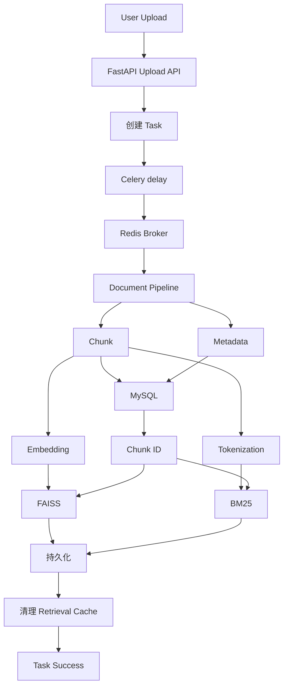
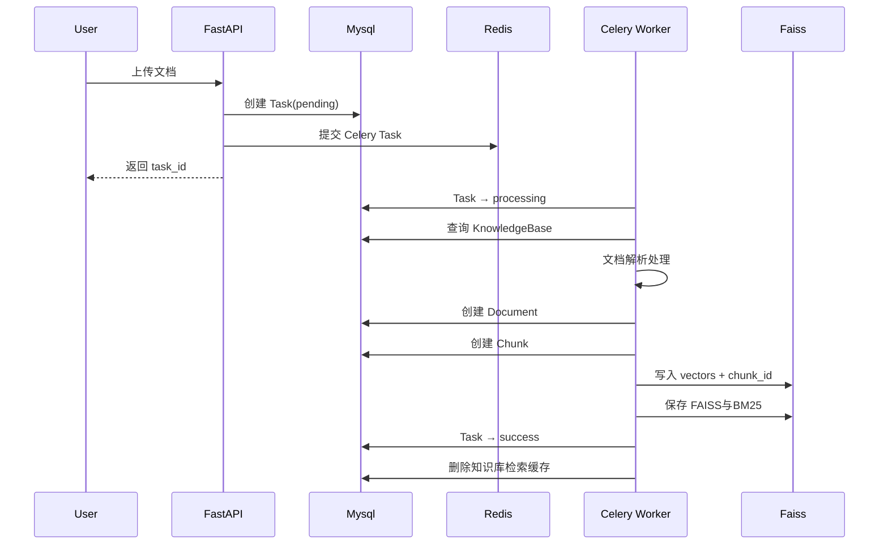
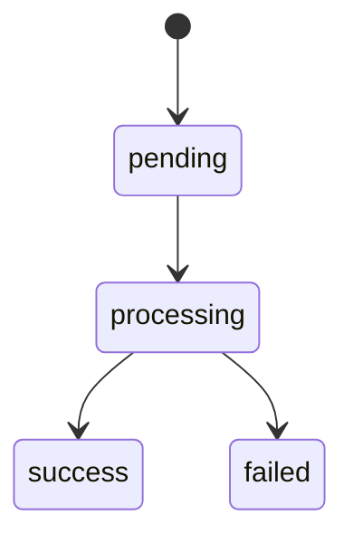

# Upload Pipeline

## 1. 模块概述

Upload Pipeline 主要处理用户上传文档后的完整异步操作。

主要职责：

- 保存文件至本地磁盘
- 解析上传的txt和pdf文档，提取文字
- 将文档内容进行split文本切分
- 将Chunk进行生成Embedding
- 将Document / Chunk 持久化到MySQL
- 持久化 Chunk 数据并生成 chunk_id
- 将向量写入FAISS
- 将分词结果写入pkl
- 建立FAISS和Chunk进行ID映射
- 持久化知识库向量索引
- 更新任务状态

核心目标：

- 将用户上传的文件转换为可以被RAG检索系统使用的结构化数据和向量索引 
- 建立 Chunk、Metadata 与向量索引之间的关联关系
- 为后续 Retrieval Pipeline 提供数据基础

## 2. 业务目标

用户上传文档，为了防止文档过大，需要进行大量的文档解析、Embedding和向量索引构建，
进而导致HTTP长时间持续占用，影响用户使用体验，
因此系统采用Celery异步任务处理：
```text
    用户上传文档
        ↓
     创建任务
        ↓
     返回task_id
        ↓
  Celery 异步后台处理
        ↓
 用户使用task_id查询处理任务
        ↓
    HTTP使用结束   
```

如果文件使用同步处理：
```text
    上传文档
      ↓
  PDF/TXT解析
      ↓
  Embedding向量化
      ↓
    FAISS
      ↓
   HTTP请求长时间等待
```

如果文件使用异步处理：
```text
    上传文档
      ↓
   创建task
      ↓
  返回task_id
      
   Celery Worker
        ↓
     后台处理
      
```
通过使用Celery，系统把耗时任务异步交给后台进程执行， 避免阻塞Web接口

## 3. 整体架构


## 4. 完整执行流程


用户上传文档后，首先创建Task，状态为pending，上传到MySQL，并返回task_id，
文档处理进入异步阶段，Task的状态变为processing，开始查询对应知识库。
文档进行parse,split,embedding处理，获取Chunk信息。
系统创建Document、Chunk存入MySQL进行数据持久化并返回chunk_id，
将vector和chunk_id写入FAISS，并保存FAISS和BM25，
Task状态转换为success标记已成功，删除知识库索引缓存。


## 5.核心流程详解

### 5.1 文件上传与任务创建

用户上传文件，根据知识库名、文件名进行路径拼接，将pdf/txt存入本地磁盘对应位置，
创建Task任务，将状态设置为pending，返回task_id。
为了进行异步任务，使用process_document_task.delay(),
通过使用delay()，进程执行就会变成：
```text
FastAPI
  ↓
发送任务
  ↓
Redis
  ↓
Celery Worker
  ↓
真正执行
```
FastAPI 不需要自己承担 PDF 解析、Embedding、FAISS 建索引这些任务。

### 5.2 Celery异步任务

系统使用Celery异步任务，
```text
FastAPI
 ↓
Redis Broker
 ↓
Celery Worker
```
Redis在Celery中充当Broker消息代理，存放待执行的任务，
实现Web进程与Worker进程之间的任务消息传递

### 5.3 文档解析

在数据持久化前，需要对文档进行解析处理：
```text
PDF/TXT
    |
  Parse
    |
Text Cleaning
    |
  split
    |
  Chunk
    |
 Embedding
    |
 {
    chunks,
    vectors,
    metadata
 }
```
系统主要支持pdf文档和txt文档的解析，
并通过chunk_size、overlap_sentence进行chunk拆分，
最后使用SentenceTransformer进行Embedding处理

其中：
Chunk切分是RAG系统的重要步骤。
如果Chunk过大：
- 召回精度下降

如果Chunk过小：
- 语义信息不完整

因此需要通过chunk_size和overlap进行平衡。

### 5.4 Document持久化
系统将文档重要信息，如kb_id、filename、file_path存入MySQL的Document表中。

### 5.5 Chunk持久化
基于文档解析阶段返回的数据，将数据存入MySQL进行数据持久化格式化

### 5.6 FAISS向量索引
根据MySQL自动生成的chunk_id，组成列表ids，同时与chunks一一对应，
共同存入FAISS中，chunk_id对应chunk作为唯一标识，用于建立FAISS向量与MySQL中Chunk记录之间的映射关系。
在后续的faiss retrieval中，进行faiss search后将chunk_id返回给用户，
通过chunk_id从数据库中获得对应chunk，提取其text以及Metadata等信息。


### 5.7 索引持久化
faiss的向量存储是基于faiss文件的，
若是将数据存放在内存，每次计算机重启都会重新造成内存消失，
系统需要重新上传文档进行拆分分析，造成大量时间浪费，
因此将文件存储到本地，每次上传都进行save，使得向量索引持久化。

由于VectorStoreManager会缓存已加载的FAISS索引，
当知识库内容发生变化后：
- 内存中的索引可能不是最新版本
- 磁盘中的索引已经更新

因此在文档上传和删除后进行remove_store()内存释放，
确保下次访问时重新加载最新索引。

### 5.8 缓存失效
由于系统为了降低重复进行的问题的开销，而使用了Redis缓存机制，
每次retrieval后会将对应内容送入Redis，今后查询同样的问题会快速从Redis中获取结果，
但是在Upload或delete文档后，会造成数据不一致，缓存中数据过时，原来的检索缓存可能失效，
因此需要进行Cache Invalidation，将过时的缓存进行删除，并在本次召回后将结果重新写回缓存。

### 5.9 任务状态更新

当用户上传文档，进行Celery异步处理时，会进行Task管理，
将Task的生命周期划分为pending、processing、success、failed，
根据任务的不同阶段更新为不同的状态。
- pending: 任务等待执行
- processing Worker: 正在处理
- success: 处理成功
- failed: 处理失败

## 6. 数据流与数据关系

由于本系统数据可分为结构化数据和非结构化数据，所需存储的数据被分布在不同的地方，
但是不同数据之间有着共同的索引：id。
```text
KnowledgeBase
      │
      ▼
Document
      │
      ▼
Chunk
      │
      ├──────────────► MySQL
      │
      └── chunk_id ──► FAISS
      

KnowledgeBase
    id=1
      │
      ▼
Document
    id=10
    kb_id=1
      │
      ▼
Chunk
    id=100
    document_id=10
```
MySQL相关数据：
- Document
- chunk
- Task
- KnowledgeBase

Faiss相关数据：
- Vector
- chunk_id

```text
FAISS
 ↓
chunk_id
 ↓
MySQL
 ↓
chunk
 ↓
metadata
```

## 7. 核心设计

### 7.1 为什么使用Celery
将耗时任务放到后台异步执行，比如：Document Upload，
防止接口卡住，提高用户体验，保持HTTP可用性。
### 7.2 为什么使用Redis
- 内存数据库，读写速度快
- 支持队列数据结构，用来存放 celery 待处理任务
- 同时可兼做结果后端、缓存

### 7.3 MySQL与FAISS如何关联
MySQL通过chunk_id作为索引，将MySQL(Chunk)和FAISS进行关联
### 7.4 多用户 / 多知识库隔离
在文档上传操作时，需要用户先进行登录，从而获取user_id，
上传任务中的所有数据库查询均携带owner_id。
例如：
- task_id + owner_id
- kb_name + owner_id
即使不同用户存在同名知识库，系统仍可保证数据隔离。

### 7.5 Cache Invalidation
由于上传、删除文档等操作，会影响Chunk中的数据，导致数据一致性遭到破坏，
因此使用缓存失效机制，在知识库内容改变后进行Cache清理。
### 7.6 异常处理
本系统使用try: finally机制，进行raise抛出异常，
对于遇到的异常，将错误原因传递给Task，并将Task状态设置为failed

## 8. 异常与失败场景

### 8.1 KnowledgeBase不存在

```text
上传任务
   ↓
知识库查询失败
   ↓
Task -> failed
```

### 8.2 文档解析失败
```text
PDF损坏
   ↓
Parse失败
   ↓
Task -> failed
```

### 8.3 Embedding失败
```text
模型加载失败
API异常
GPU不足
```

### 8.4 MySQL写入失败
```text
Document创建失败
Chunk创建失败
```

### 8.5 FAISS保存失败
```text
磁盘空间不足
权限问题
文件损坏
```

### 统一处理机制
```
try:
    ...
except Exception:
    task.status = "failed"
    task.error_message = str(e)
    raise
finally:
    db.close()
```

## 9. 一致性问题

### 9.1 MySQL 与 FAISS存储独立
```text
Chunk
  ↓
MySQL成功

FAISS失败
```
可能会出现MySQL有数据，FAISS无数据

### 9.2 Task状态更新失败
```text
FAISS保存成功
 ↓
Task更新失败
```

可能出现：数据已经构建完成，Task显示失败


### 9.3 解决方案
- 记录失败原因
- 重新构建索引

### 9.4 后续优化

- MySQL事务
- 自动重试机制
- 失败补偿机制
- 索引一致性校验

## 10. 后续优化方向

### 10.1 Task进度管理

利用self.update_state()
实现：
0%
20%
50%
80%
100%

可视化的百分比进度，可以极大地增强用户体验。

### 10.2 MySQL事务
对 Document、Chunk、Task 等数据库操作使用事务管理，
保证数据库内部的一致性。

### 10.3 补偿机制
当 FAISS 保存失败时，
自动删除本次创建的 Document 与 Chunk 数据，
避免产生脏数据。

### 10.4 索引校验机制
定期校验Chunk数量与FAISS向量数量，
发现异常则自动重建索引。

## 11. 模块总结

Upload Pipeline 是整个知识库系统的数据入口模块，主要负责将用户上传的文档转换为系统可以检索管理的知识数据。

在文档上传过程中，系统通过使用Celery异步任务机制，将耗时较多的文档解析、文本切分、Embedding生成和索引构建
等操作从Web请求中解耦，避免上传过程一直阻塞FastAPI接口，提高系统响应速度和用户体验。

经过Upload Pipeline处理后，文档数据会被转换为：
MySQL结构化数据：
- Knowledge
- Document
- Chunk
- Task

FAISS向量数据：
- Vector
- chunk_id

BM25中关键词索引
- Chunk分词结果
- Chunk ID映射关系
- BM25统计模型

其中系统通过chunk_id建立了MySQL和FAISS之间的关联关系，实现向量检索结果到原始文本内容的映射。

在工程设计上，本模块实现了：
- Celery + Redis 异步任务处理
- 多用户、多知识库数据隔离
- FAISS 向量索引持久化
- BM25 索引持久化
- Retrieval Cache 缓存失效机制
- Task 生命周期管理
- 异常处理与失败状态记录

整个 Upload Pipeline 为后续 Retrieval Pipeline 提供了完整的数据基础，是知识库构建流程中的核心模块。