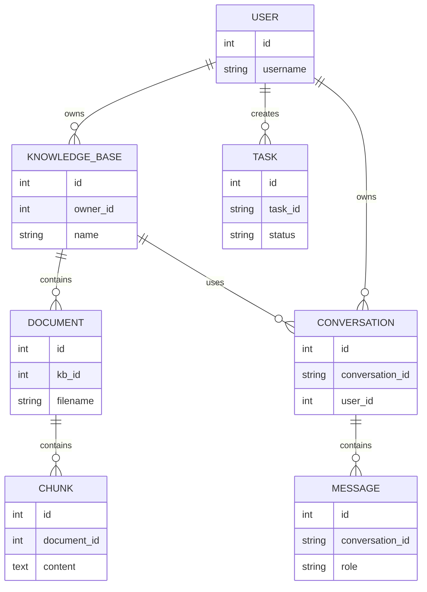

# Database Design

## 1. Overview

在最初的版本，kb,documents,chunks等数据存储在本地文件，
但是随着系统支持：
- 多用户
- 多知识库
- 文档信息
- RAG检索
- 异步任务管理
- 对话历史保持

因此系统采用：

- MySQL：存储业务结构化数据
- FAISS：存储向量索引
- BM25：存储关键词检索索引

其中MySQL作为系统核心数据源，
FAISS和BM25通过chunk_id与MySQL中的Chunk数据建立关联。

### 整体架构
```text
                MySQL
                  |
    +-------------+-------------+
    |             |             |
    User    KnowledgeBase     Task
                  |
               Document
                  |
                Chunk
                  |
               chunk_id
                  |
        +---------+---------+
        |                   |
      FAISS               BM25
   vector index       keyword index
                  
```

## 2. Database Tables

### User

保存用户账户信息

表名：

| 字段            | 类型       | 说明   |
|---------------|----------|------|
| id            | int      | 用户ID |
| username      | string   | 用户名  |
| password_hash | string   | 密码哈希 |
| created_at    | datetime | 创建时间 |

作用：
- 用户登录认证
- 多用户数据隔离
- 管理知识库、任务、聊天记录

### KnowledgeBase

保存用户创建的知识库。

表名：knowledge_base

| 字段          | 类型       | 说明     |
|-------------|----------|--------|
| id          | int      | 主键     |
| owner_id    | int      | 所属用户   |
| name        | string   | 知识库名称  |
| description | string   | 描述     |
| created_at  | datetime | 创建时间   |

关系：
```text
User
  |
  |1:N
  |
KnowledgeBase
```

作用：
- 管理不同用户的知识库
- 实现知识库隔离

### Document
保存上传文本信息

表名：document

| 字段         | 类型       | 说明    |
|------------|----------|-------|
| id         | int      | 主键    |
| kb_id      | int      | 所属知识库 |
| filename   | string   | 文件名   |
| file_path  | string   | 文件路径  |
| created_at | datetime | 上传时间  |

关系：
```text
Knowledge
    |
    |1:N
    |
  Document
```

作用：
- 记录用户上传文件
- 管理文档生命周期

### Chunk
保存文档切分后的chunks

表名：chunk

| 字段            | 类型   | 说明      |
|---------------|------|---------|
| id            | int  | 主键      |
| document_id   | int  | 所属文档    |
| content       | text | chunk文本 |
| chunk_index   | int  | chunk序号 |
| metadata_info | json | 元数据     |

关系：
```text
Document
    |
    |1:N
    |
  Chunk
```

作用：
- FAISS通过chunk_id建立向量和文本映射
- BM25通过chunk_id关联文本数据
- RAG阶段通过chunk_id获取content和metadata

### task

| 字段            | 类型       | 说明         |
|---------------|----------|------------|
| id            | int      | 主键         |
| task_id       | string   | Celery任务ID |
| owner_id      | int      | 用户ID       |
| filename      | string   | 文件名        |
| status        | string   | 任务状态       |
| error_message | string   | 错误信息       |
| created_at    | datetime | 创建时间       |

任务生命周期：
```text
        pending
           |
           v
       processing
           |
     +-----+-----+
     |           |      
  success      failed
```
作用：

- 记录Celery执行状态
- 保存失败原因
- 提供任务查询接口

### Conversation
保存用户聊天会话。

表名：conversation

| 字段              | 类型       | 说明    |
|-----------------|----------|-------|
| id              | int      | 主键    |
| conversation_id | string   | 会话ID  |
| user_id         | int      | 用户ID  |
| kb_id           | int      | 使用知识库 |
| title           | string   | 标题    |
| created_at      | datetime | 创建时间  |

关系：
```text
 User+KnowledgeBase
  |
  |1:N
Conversation
```

### Message
保存聊天记录。

表名：message

| 字段              | 类型       | 说明   |
|-----------------|----------|------|
| id              | int      | 主键   |
| conversation_id | string   | 所属会话 |
| role            | string   | 角色   |
| content         | text     | 消息内容 |
| created_at      | datetime | 时间   |

关系：
```text
Conversation
   |
   |1:N
Message
```

## 3. Table Relationship



## 4. MySQL与索引系统关系
MySQL：
```text
Knowledge
Document
Chunk
Task
Conversation
Message
```

FAISS:
```text
embedding vector
chunk_id
```

BM25:
```text
token statistics
chunk_id
```

查询流程：
```text
            User Query
                |
      +---------+---------+ 
      |                   |
Query Embedding        tokenize
      |                   |
  FAISS Search        BM25 Search
      |                   |      
   chunk_id < ————————————+
      |      
  MySQL Chunk
      |      
content+metadata
      |     
  LLM generate    
```

## 5. 设计总结

数据库设计主要解决：

### 5.1 数据隔离
```text
User
 |
owner_id
 |
KnowledgeBase
```
保证不同用户数据隔离。

### 5.2 向量索引关联
通过chunk_id建立：
```text
FAISS/BM25
      |
      |
  chunk_id
      |
      |
 MySQL Chunk
      |
content + metadata
```

### 5.3 异步任务管理
通过Task表记录：
```text
pending
processing
success
failed
```

### 5.4 RAG数据链路
完整链路：
```text
User
 ↓
KnowledgeBase
 ↓
Document
 ↓
Chunk
 ↓
chunk_id
 ↓
FAISS/BM25
 ↓
Retrieval
 ↓
LLM
```
