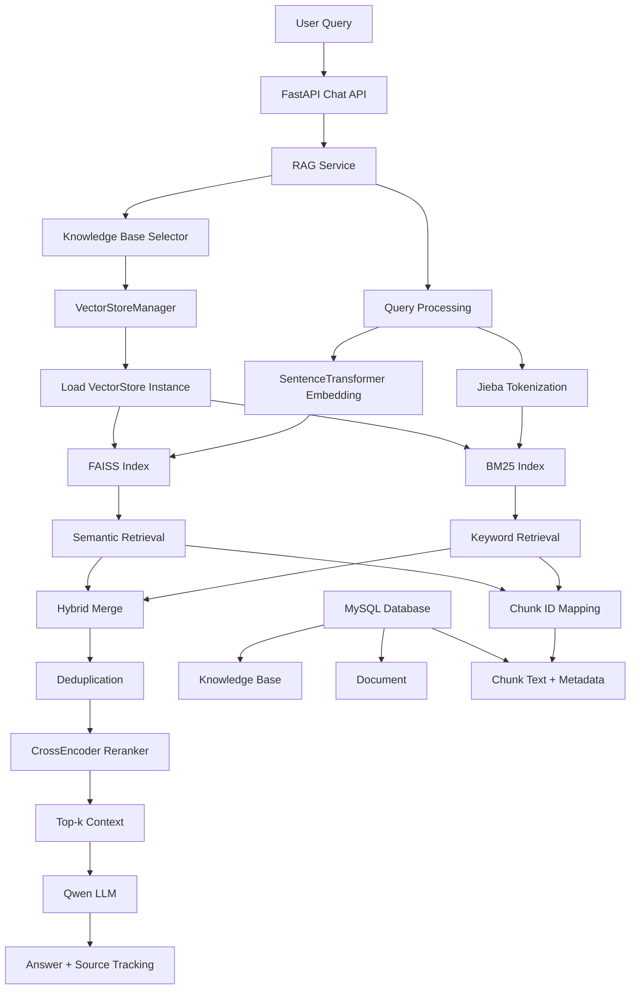

# v2_rag.md

## 1. Overview

V2版本在基础 RAG 系统基础上进行了工程化升级，
实现从简单向量检索系统到多知识库、数据库驱动的完整 RAG Pipeline。

主要升级包括：

- Multi Knowledge Base
- MySQL Metadata and Chunk Persistence
- FAISS Vector Retrieval
- Hybrid Retrieval
- BM25 Key Retrieval
- CrossEncoder Rerank
- Retriever Evaluation
- Docker Container Deployment
- Retriever Interface Abstraction

整体实现从简单向量检索升级为完整 RAG Pipeline。

## 2. Overall Architecture

